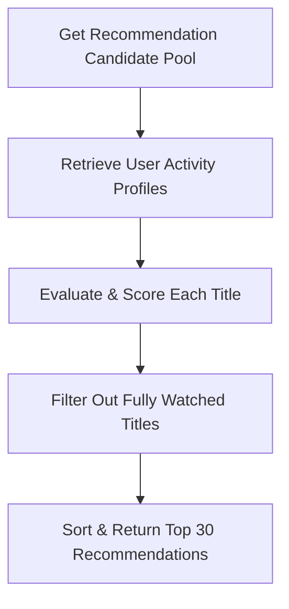

# MovieTime 🍿

MovieTime is a high-performance, real-time movie/TV show streaming web application with multi-user Watch Party synchronization and local recommendation systems.


---

## 🏗 System Architecture

The application is structured as a monorepo consisting of a high-fidelity **React frontend** and a real-time **Node.js/Socket.io backend** featuring Redis-backed room state management.

```mermaid
graph TD
    Client1[MovieTime Frontend Client 1] <-->|WebSocket Connection| SocketNS[/watch-party namespace]
    Client2[MovieTime Frontend Client 2] <-->|WebSocket Connection| SocketNS
    SocketNS <--> Server[Node.js WatchParty Server]
    Server <--> Cache[(Redis Memory Store)]
    Client1 <-->|REST API| TMDB[TMDB Catalog API]
```

### 1. Frontend Architecture
- **Tech Stack**: React 18, Vite, React Router v7, Framer Motion, Tailwind CSS v4, Lucide Icons.
- **Routing**: Client-side single page app routing with dynamic lazy-loaded routes (e.g. video player, detail views).
- **Caching**: Session storage-based data caching `cache.ts` stores item data during navigation to minimize API queries.
- **State & Storage**: Cookies and `localStorage` manage watch progress, watchlist history, likes, and recommendation settings.

### 2. Backend Architecture
- **Tech Stack**: Node.js, Express, Socket.io, TypeScript.
- **Real-Time namespaces**:
  - `/watch-party`: Event-driven and periodic state synchronizations using latency compensation engines.
  - `/chat`: Real-time Watch Party text communications.
  - `/presence`: Tracking active connections and host statuses inside rooms.
- **Data Store**: Redis Client manages room details, host assignments, and playback updates.

---

## ⚡ Core Engine Features

### 🎬 Real-Time Playback Synchronization Engine
The backend features a `SyncEngine` for calculating latency drift between the Watch Party host and participants. 
```typescript
// Latency Compensation Evaluation
export class SyncEngine {
  static evaluateDrift(
    hostState: PlaybackState,
    guestTimestamp: number,
    networkDelayMs: number
  ): DriftEvaluation {
    const elapsedSinceLastUpdate = (Date.now() - hostState.lastUpdateTime) / 1000;
    const estimatedHostTimestamp = hostState.isPlaying 
      ? hostState.timestamp + elapsedSinceLastUpdate 
      : hostState.timestamp;
      
    const drift = Math.abs(estimatedHostTimestamp - guestTimestamp);
    
    // Auto-correction threshold set to 1.5 seconds
    return {
      needsCorrection: drift > 1.5,
      targetTimestamp: estimatedHostTimestamp + (networkDelayMs / 1000)
    };
  }
}
```

### 🧠 Client-Side Recommendation Engine

A zero-backend recommendation model running directly in the browser. It follows a multi-stage hybrid pipeline to score and suggest movies:



#### 1. The Scoring Model Formula
For each candidate title, the algorithm computes a composite **Relevance Score ($S$)** using a weighted linear combination of matching dimensions:

$$S = (N_{\text{fav}} \times 5) + (N_{\text{watchlist}} \times 3) + (N_{\text{history}} \times 2) + \max(0, R_{\text{TMDB}} - 6) \times 1.5$$

- **Explicit Preferences ($N_{\text{fav}}$)**: Matches explicitly chosen genres in the preference picker (+5 points per match).
- **Watchlist Overlaps ($N_{\text{watchlist}}$)**: Genres matching active bookmarks in the watchlist (+3 points per match).
- **History Matching ($N_{\text{history}}$)**: Genres matching previously watched titles (+2 points per match).
- **Critic Rating Bonus ($R_{\text{TMDB}}$)**: High-quality rating scaling for items rated above 6.0 (+1.5 points per step).

#### 2. Code Snippet
```typescript
// Scoring Logic
const scored: ScoredItem[] = candidatePool.map(item => {
  let score = 0;
  const reasons: string[] = [];
  const itemGenres = item.genre ? item.genre.split(',').map(s => s.trim()) : [];
  const itemId = item.tmdb_id || item.imdb_id;

  // Skip if watched or completed
  if (history.some(h => h.id === itemId)) return null as any;

  // Match with selected genres
  const favMatches = itemGenres.filter(g => selectedGenres.includes(g));
  if (favMatches.length > 0) {
    score += favMatches.length * 5;
    reasons.push(`Matches favorite: ${favMatches.slice(0, 2).join(', ')}`);
  }

  // Match with watchlist preferences
  const watchlistMatches = itemGenres.filter(g => watchlistGenres.includes(g));
  if (watchlistMatches.length > 0) {
    score += watchlistMatches.length * 3;
    reasons.push(`Similar to items in watchlist`);
  }

  // Rating bonus
  const ratingVal = parseFloat(item.rating);
  if (!isNaN(ratingVal) && ratingVal > 6) {
    score += (ratingVal - 6) * 1.5;
  }

  return { item, score, reasons };
}).filter(Boolean);
```


---

## 🚀 Setup & Execution

### Running the Frontend
1. Navigate to the frontend directory:
   ```bash
   cd fontend
   ```
2. Install dependencies:
   ```bash
   npm install
   ```
3. Run in development mode:
   ```bash
   npm run dev
   ```

### Running the Backend
1. Navigate to the backend directory:
   ```bash
   cd backend
   ```
2. Install dependencies:
   ```bash
   npm install
   ```
3. Start the node server:
   ```bash
   npm run dev
   ```